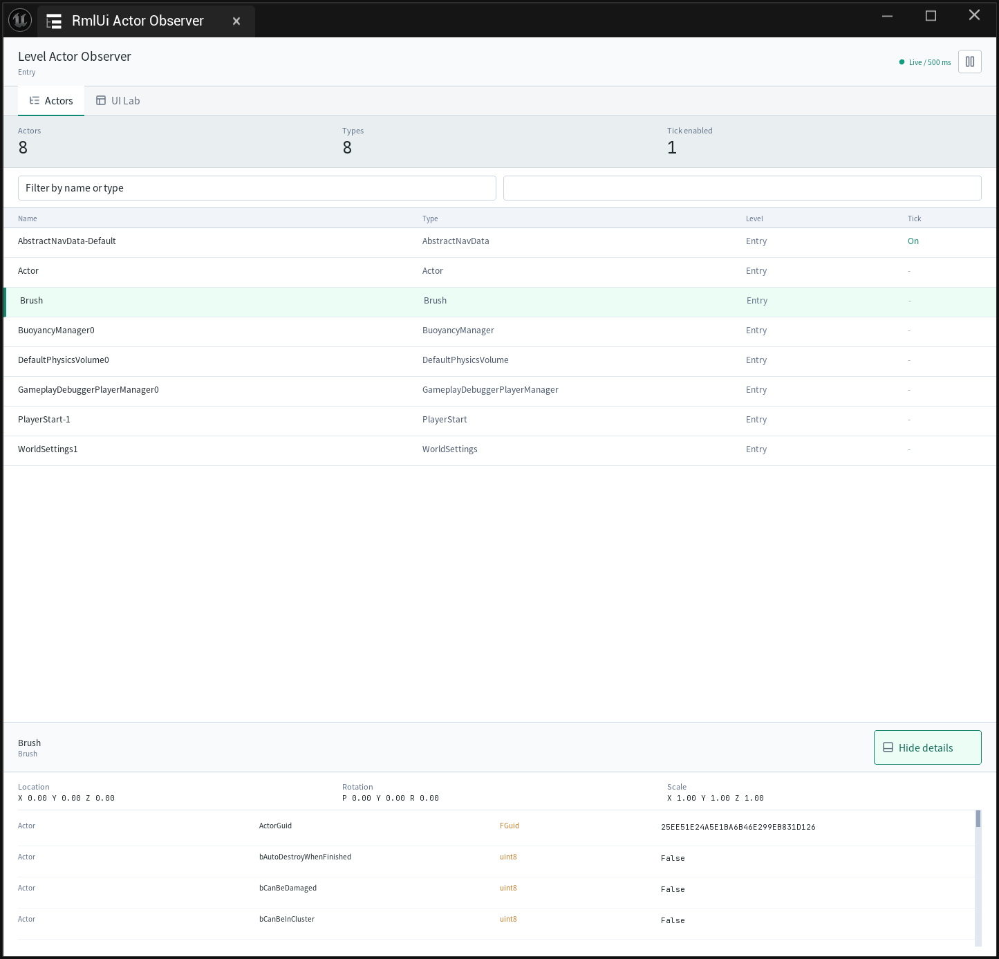
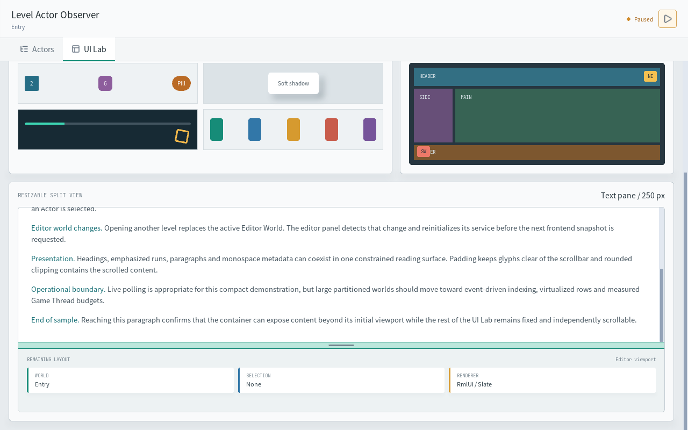
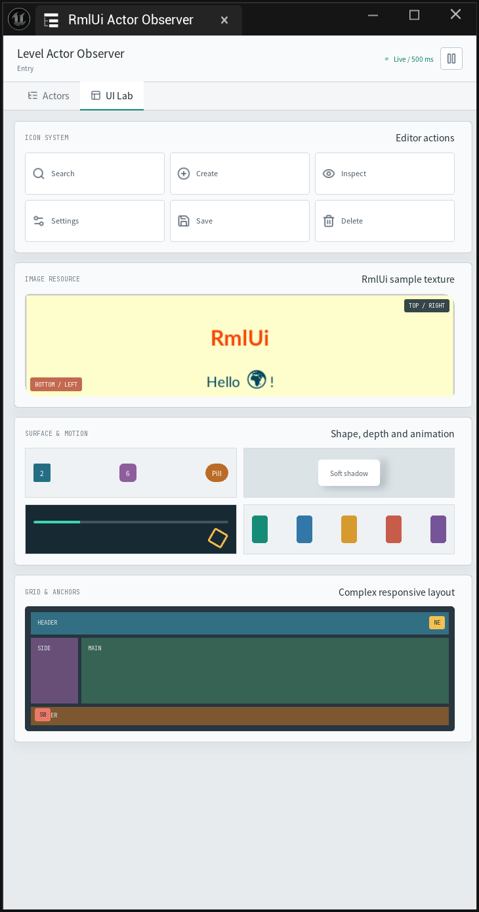

# RmlUi Unreal

English | [简体中文](README.zh-CN.md)


RmlUi Unreal is a unified Unreal Engine plugin for building game and editor interfaces with RmlUi, HTML-like RML, CSS/RCSS, native CSS Grid, Vue 3, and typed Unreal services through Puerts. It is designed to make AI-authored UE interfaces practical while moving their rendering cost and integration model as close to native Unreal UI as the supported content allows. It integrates with UMG and Slate and does not require changes to Unreal Engine source.

> [!IMPORTANT]
> This is not an embedded browser. Documents must follow RmlUi's XML-compatible markup and supported RCSS semantics. Browser DOM APIs, arbitrary websites, and drop-in browser component libraries are outside the project scope.

## Showcase

The included Actor Observer demonstrates a live editor workflow: it reads actors from the current Editor World through a typed Puerts service, keeps selection stable, and optionally displays reflected properties and transforms. Its UI Lab demonstrates icons, Grid and Flex layouts, rounded corners, shadows, animation, images, color palettes, responsive composition, Apache ECharts no-DOM SVG SSR with an editable slider-backed data table, and a long-form text surface with an independently styled native scrollbar and draggable vertical split boundary. It also registers a real transient Unreal User Interface material under the host-owned `showcase.energy` alias and uses a native range input to update its MID vector parameter through a typed Puerts service. This editor showcase demonstrates the `UMaterial -> MID -> FSlateMaterialBrush` path; it is not a cooked `.uasset` sample. The separate Tree Canvas tab uses d3-hierarchy only for tidy-tree coordinates, then renders selectable and collapsible nodes plus orthogonal edges as native RmlUi elements with canvas pan and zoom controls. The Dialogs tab adapts the Headless UI Dialog contract and common shadcn/ui Dialog, Alert Dialog, and Sheet patterns to native RmlUi nodes, including backdrop dismissal, Escape, initial focus, and focus restoration. The Mask Frame tab combines a real SVG `<mask>`, layered LunaSVG gradients and rays with native RmlUi animation. Its four flow bands start with measured pixel endpoints after layout and restart on resize. Four moving energy bands and ten drifting sparks create a bright, overflowing gold edge while the center remains transparent; `pointer-events:none` keeps the overlay input-transparent. This effect does not use an Unreal material or per-frame C++ updates. RmlUi `ninepatch` or `tiled-box` remains the better alternative when the frame is authored as a fixed ornamental texture atlas. The Scene Overlay tab adds a translucent native HUD over an actual Unreal camera, high-contrast cyan/amber/blue cubes, a gold sphere, floor, backdrop, directional light, and three colored point lights. Its central opening leaves RmlUi pixels transparent, while a native range input changes panel alpha at runtime; it does not copy the scene into a UI texture or emulate browser `backdrop-filter`.

The Actor Observer also includes a **Motion Menu** tab with a transitions.dev-inspired dropdown, origin-aware scale/opacity transitions, and Vue-driven selection and close state.

### Live Actor Inspector



### UI Capability Lab

| Wide layout | Narrow layout |
| --- | --- |
|  |  |

## Performance Comparison

Low-latency, in-process UE data access and reduced full-frame pixel transfers are two measured strengths. The results below were collected in UE 5.8.1 Development Editor on a Ryzen 9 9950X / RTX 5080 with DX11/DX12.

### C++ data access

| UI solution | Measured C++ data access |
| --- | --- |
| WebBrowser | JSON event round trip: **7.3–8.0 ms**; official Promise binding: **7.8–8.3 ms** (median serial RTT) |
| RmlUi | Through Puerts: float read **0.105–0.115 µs/read**; live property read through a cached UObject proxy **~0.058 µs/read** (median amortized cost of synchronous batches) |

Each scenario uses 2 warmup batches and 5 measured batches: 128 WebBrowser requests or 100,000 RmlUi reads per batch, with C++ changing the value and verifying returned results each time. WebBrowser RTT includes CEF/UE scheduling, while RmlUi uses synchronous, in-process Puerts calls; the two measurements do not directly translate into overall CPU or UI speedup ratios. Raw data: [DX11](Docs/Performance/2026-09-12/DX11/CommunicationComparison.json), [DX12](Docs/Performance/2026-09-12/DX12/CommunicationComparison.json).

### Rendering time and full-frame transfers

With the same 1280×800, 100-row fixture, the RmlUi Slate/RHI path reduces mean `RenderFrame` time by **77.5%–79.0%** and eliminates full-frame pixel uploads:

| RmlUi rendering path | Mean `RenderFrame` time | Full-frame pixel uploads |
| --- | ---: | ---: |
| Private DX11 backend | 6.306–7.202 ms/frame | 3.90625 MiB/frame |
| Slate/RHI backend | **1.418–1.509 ms/frame** | **0 MiB/frame** |

Each path uses a 10-second warmup and 60-second sample with the same font, row height, and header update requests. This compares plugin-stage time across this project's two RmlUi backends. Slate/RHI is experimental; zero refers only to full-frame uploads, with texture deltas, geometry submission, and GPU work still present. Raw four-way data: [DX11](Docs/Performance/2026-09-12/DX11/RmlUiComparison-D3D11-Windowed.json), [DX12](Docs/Performance/2026-09-12/DX12/RmlUiComparison-D3D12-Windowed.json).

## Features

### Built for Unreal UI, not browser embedding

UE's standard WebBrowser is the right choice when a project must display existing websites or depend on broad browser DOM, CSS, and Web API behavior. On desktop, that solution carries a Chromium/CEF-style browser runtime and composites browser-rendered content into Unreal. RmlUi Unreal takes a different route: it uses a controlled UI document model, integrates application data and rendering explicitly with Unreal, and avoids carrying a browser DOM/layout/paint stack for pages that do not need one.

| Area | UE WebBrowser | RmlUi Unreal |
| --- | --- | --- |
| Primary use | Existing web applications and browser content | Game UI, editor tools, live data panels, and controlled AI-authored UI |
| Runtime model | Browser document, JavaScript, layout, paint, and browser process/runtime semantics | RmlUi document/layout plus required Puerts/V8 for controlled application logic |
| Unreal API integration | Browser-oriented script bridge and callbacks | Allowlisted typed UObject services, UFUNCTION arguments/returns, returned UObject proxies, UMG widgets, and Slate hosting |
| Unreal-specific rendering | Browser surface presented inside Unreal | UE UI Material aliases and MID parameters, Slate input, resource ownership diagnostics, and an evolving direct RHI/RDG path |
| Content delivery | Normal web URL/resource and cache model | Cooked UFS content, content-addressed manifests, SHA-256 checks, atomic activation, rollback, and packaged runtime compilation |
| Compatibility tradeoff | Much broader browser compatibility | Smaller, deterministic surface with explicit unsupported-feature diagnostics |

Unreal-focused features implemented by this project include `URmlUiWidget` and `URmlUiWebWidget`, the editor Preview and Actor Observer tabs, current Editor World binding, native Slate event routing, host-controlled UI Material registration, stable resource IDs and owner trees, Unreal Insights lifecycle events, and DX11/DX12 packaged validation. These are application and engine integration advantages, not a claim that every RmlUi page is already faster than WebBrowser. The default complete renderer still performs a DX11 readback/upload; [Performance Comparison](#performance-comparison) records the completed communication and controlled rendering tests, while broader page, GPU, and multi-view validation remain active work.

### Reconstructing a practical web stack

The project recreates the parts of the web development stack that are most useful for UE interface work, while keeping the runtime controlled and packageable:

- XML-compatible HTML/RML, RCSS, images, fonts, responsive media rules, Flexbox, and Taffy-backed native CSS Grid.
- Common visual features including rounded corners, shadows, gradients, transforms, transitions, keyframe animation, clipping, scrolling, and responsive wide/narrow layouts.
- A Vue 3 custom renderer with SFC compilation, Composition API, props/emits, keyed reconciliation, fragments, scoped styles, reactive forms, and frame-owned events and timers.
- Host ABI 2 node queries, batched layout metrics, theme tokens, independent default-action cancellation, pointer capture, Teleport and nested modal focus. The Interaction Lab tab demonstrates these with radio/collection forms and scrolling popovers; see [the shared CSS contract](Tools/CSS_COMPILER.md) for strict profiles and explicit degradation.
- Typed Puerts services for Unreal business data, plus an explicit JSON compatibility channel for dynamic or legacy protocols.
- PostCSS and htmlparser2 build/runtime compilation that normalizes known browser conventions and rejects unsupported transformations atomically.
- Native Markdown and syntax highlighting, UE HTTP/SSE streaming, versioned hot updates, state-preserving remounts, and rollback.

The compatibility work is tested against real framework and library patterns rather than only handwritten demos:

| Ecosystem | Verified use in this project |
| --- | --- |
| Vue 3 | Custom-rendered SFC applications, lifecycle, forms, reconciliation, typed UE calls, updates, and VM replacement |
| Tailwind CSS 3 | Actor Observer and UI Lab utilities compiled into the supported RCSS subset |
| markdown-it / highlight.js | Native Markdown Chat with tables, lists, code blocks, CJK, streaming, and error states |
| Lucide | Build-time rasterized icons used by the UI Lab and Chat surfaces |
| Apache ECharts 6.1 | No-DOM SVG SSR rendered through RmlUi/LunaSVG; native range inputs update the table and regenerate chart markup |
| d3-hierarchy 3.1 | DOM-free tidy-tree layout feeding native RmlUi nodes and edges; selection, branch collapse, canvas pan, and zoom are handled by Vue/RmlUi |
| Floating UI core 1.8.0 | The actual package runs on a custom native measurement platform; Popover follows scrolling, viewport and DPI changes, with flip/shift/hide middleware |
| TanStack Table / Virtual cores | Table Core 8.21.3 sorts and filters 2,000 records; Virtual Core 3.17.10 consumes native rect/offset observations and mounts only the RmlUi row window |
| Headless UI / shadcn/ui patterns | Native RmlUi compatibility components exercise Dialog, Alert Dialog, and Sheet interactions; upstream DOM/Portal runtimes are not bundled or claimed compatible |
| Magic.css / Hover.css / transitions.dev | Upstream animation, transition, and stateful dropdown patterns exercised by WebCompat conversion and native runtime tests |
| Bulma | A Card-structure subset exercised through the WebModernV1 profile and native pixel fixture |

Compatibility is established pattern by pattern; the table is not a claim that the complete distribution of every library works unchanged. The roadmap expands this corpus with more common component libraries, CSS patterns, form behavior, and browser-differential fixtures.

### AI-authored UE interfaces, with a native-performance direction

The product direction is to let an AI produce familiar HTML/CSS and component-oriented UI, turn that output into a deterministic UE asset, connect it to typed Unreal services, and receive actionable diagnostics instead of a blank browser-like failure. The current foundation already provides strict structured compilation, compatibility profiles, runtime compilation through Puerts, content hashes, cache reuse, atomic failure, responsive fixtures, and packaged execution.

Future work is organized around that goal:

1. Grow a real AI-generated HTML/CSS corpus and a versioned compatibility matrix for common web components and interaction patterns.
2. Map RCSS, compiler, and runtime diagnostics back to source locations so an AI can repair unsupported output automatically.
3. Extend forms, input, IME, accessibility, localization, component patterns, and controlled Web APIs according to real UI demand.
4. Move more supported rendering directly through Slate/RHI/RDG, preserve native UE Material integration, reduce readback and redundant resource work, and add device recovery.
5. Benchmark equivalent workloads against UE WebBrowser and native Slate with end-to-end CPU, GPU, memory, latency, and multi-view measurements.

The performance objective is to approach native Unreal UI for the supported subset; it is a roadmap target that will be demonstrated with comparable measurements, not assumed from architecture alone.

## Module Architecture

One plugin descriptor owns all RmlUi functionality. Puerts remains a required sibling plugin.

| Module | Type | Responsibility |
| --- | --- | --- |
| `RmlUiUnreal` | Runtime | Core RmlUi lifecycle, UMG/Slate widget, rendering, resources, input, fonts, and materials |
| `RmlUiUnrealWebCompat` | Runtime | Versioned compatibility profiles and web-compatible widget API |
| `RmlUiUnrealWebCompatPuerts` | Runtime | Packaged Puerts provider for dynamic HTML/CSS compilation |
| `RmlUiUnrealJS` | Runtime | Vue runtime, typed service bridge, updates, Actor Observer service, and chat transport |
| `RmlUiUnrealEditor` | Editor | RmlUi preview and editor integration |
| `RmlUiUnrealJSEditor` | Editor | Actor Observer Nomad tab and editor-world lifecycle |

Raw `URmlUiWidget` pages do not automatically start Vue or apply WebCompat rules. Choose `URmlUiWebWidget` for a compatibility profile and create `URmlUiJSRuntime` for a Vue application. The modules share one build, cook, packaging, and release boundary.

## Compatibility

| Component | Current verified target |
| --- | --- |
| Unreal Engine | 5.8.1, CL 56057345 |
| Platform | Win64 |
| RmlUi | 6.3, pinned source |
| Vue | 3.5.42 |
| Puerts / V8 | Required sibling plugin / V8 11.8.172 |
| Host RHI | DX11 and DX12 packaged smoke coverage |
| Compiler | MSVC 14.44 / Windows SDK 10.0.22621.0 |

Other engine versions and platforms require a deliberate port and fresh validation.

## Installation

Place both plugins next to each other in the receiving project:

```text
YourProject/
└── Plugins/
    ├── Puerts/
    └── RmlUiUnreal/
        └── RmlUiUnreal.uplugin
```

`RmlUiUnreal.uplugin` enables Puerts as a required dependency. A source checkout also needs Puerts' matching `ThirdParty/v8_11.8.172` payload.

For a prebuilt distribution, keep the supplied `Binaries/ThirdParty/Win64/RmlUiBridge.dll` and import library. For a fresh source checkout, build the native bridge once:

```powershell
./Source/ThirdParty/RmlUiBridge/BuildBridge.ps1
```

Rebuilding the bridge requires CMake, Visual Studio 2022 C++ tools, a Windows SDK, and an MSVC Rust/Cargo toolchain. The native dependencies are pinned and vendored for locked offline builds.

## Quick Start

### UMG and Blueprint

1. Enable **RmlUi Unreal** and restart the editor.
2. Add **RmlUi Document** to a Widget Blueprint.
3. Set a document path under `Project/Content/RmlUi` or provide inline RML.
4. Bind document events or call the Blueprint DOM helpers for application behavior.
5. Open **Tools > RmlUi Preview** to inspect documents without starting the game.

Use **RmlUi Web-Compatible Document** when the page needs the `WebModernV1` compatibility profile. Use **Tools > RmlUi Actor Observer** to open the live editor example; PIE is not required.

### C++

Add only the modules used by the host module:

```csharp
PublicDependencyModuleNames.AddRange(new[]
{
    "RmlUiUnreal",
    "RmlUiUnrealWebCompat",
    "RmlUiUnrealJS"
});
```

For a Vue screen, retain both the widget and runtime as UPROPERTY-owned objects, register only the business services needed by that screen, and then start the runtime:

```cpp
Runtime->RegisterService(TEXT("host"), HostService);
Runtime->Start(RmlWidget, TEXT(""), true); // Empty path selects Content/Vue/current.json.
```

Call `Stop()` when the owning screen closes. Service registration is frozen while a runtime is active. JSON HostRequest remains available for dynamic compatibility flows, but normal application calls should use typed Puerts services.

## Frontend Development

Frontend sources and lockfiles live in `Frontend`. Generated Vue, Chat, and Actor Observer bundles are published atomically under `Content`.

```powershell
cd Frontend
npm ci
npm run typecheck
npm test
npm run build
```

The surrounding `RmlUiUnrealTest` host project contains launch, watch, packaging, and end-to-end smoke scripts. It is intentionally not part of this plugin repository.

## Rendering Paths

The default complete renderer uses RmlUi's official DX11 backend on a private device, reads the rendered surface to CPU memory, and uploads it to an Unreal texture. It works when the Unreal host runs with DX11 or DX12, but it is an evaluation path rather than a zero-copy renderer.

The opt-in Slate command renderer replays supported RmlUi geometry through persistent RHI buffers and RDG passes, while native Unreal UI materials stay on Slate's material pipeline. Strict 2D affine transforms, rectangular scissors, rounded convex masks, textures, text, background/border material slots, and inherited opacity have dedicated coverage. Perspective/3D transforms, inverse or concave material masks, layers, filters, and RmlUi shaders are not yet feature-complete on this path.

The currently verified color contract is SDR sRGB. HDR, wide gamut, device loss recovery, and native backends for non-Windows platforms are not validated.

## Validation Status

The latest unified-plugin validation used Unreal Engine 5.8.1 on Win64:

- Editor Development, Game Development, and Game Shipping clean plugin builds passed with the required Puerts dependency.
- Full Development cook processed 500 packages with 0 errors and 0 warnings; Stage, Pak, IoStore, and Archive passed.
- Core packaged smoke passed 90 checks on each of DX11 and DX12.
- Vue packaged smoke passed 108 checks on DX11 and 109 on DX12, with the same 84 distinct labels.
- Chat packaged smoke passed 117 checks on each RHI against a deterministic local SSE fixture.
- Dynamic WebCompat packaged smoke passed 15 checks on each RHI, including Puerts runtime compilation and cache reuse.
- Actor Observer standalone smoke passed 530 checks on each RHI with 29 screenshots, including the SVG-masked gold screen edge, UE UI Material, native overlay patterns, TanStack headless table/virtual-list interactions, and translucent composition over a verified World `AStaticMeshActor` using the Engine Cube mesh; its editor Nomad Tab automation passed with 0 warnings.
- Eight packaged reports produced 42 non-empty screenshots with no fatal, assertion, or unhandled-exception signal in their runtime logs.

These results do not claim Shipping runtime behavior, non-Windows support, production performance, physical OS input/IME coverage, arbitrary website compatibility, or real model-service quality.

## Project Layout

```text
RmlUiUnreal/
├── Config/                  Plugin packaging rules
├── Content/                 RML, RCSS, profiles, compiled UI bundles, fonts, and examples
├── Docs/Images/             README showcase assets
├── Frontend/                Vue, Chat, Actor Observer, build tools, and frontend tests
├── Shaders/                 Unreal shaders for the Slate/RHI path
├── Source/                  Six Unreal modules and vendored native bridge sources
├── Tools/                   WebCompat compiler and tests
└── RmlUiUnreal.uplugin      Unified plugin descriptor
```

## Documentation

- [Vue and typed Puerts integration](JS_README.md)
- [Native Markdown chat](CHAT.md)
- [Web compatibility profiles and compiler](WEB_COMPAT.md)
- [Native CSS Grid support](GRID_SUPPORT.md)
- [Native bridge dependencies](Source/ThirdParty/RmlUiBridge/DEPENDENCIES.md)

## Known Boundaries

- RmlUi markup is XML-compatible; normal browser error recovery and DOM APIs are not available.
- Puerts is a trusted-code integration, not a JavaScript security sandbox. Remote manifests must come from a trusted publisher.
- Windows IME is connected through UE's text input method context and tested at the native/UE interface level. Real OS candidate-window testing was blocked by desktop access permissions and is still outstanding. Complex-script shaping, Lottie, Lua extensions and browser accessibility APIs remain unsupported; trusted SVG is rasterized through LunaSVG, without a browser SVG DOM.
- Vue updates remount the application and restore explicitly serialized state; they are not browser Vue HMR.
- Performance budgets, long-running memory stability, multi-instance persistence, HDR, and device recovery require separate production validation.

## Contributing

Keep changes scoped to the plugin, preserve the module boundaries above, and accompany behavior changes with focused frontend/native/Unreal coverage. Run the relevant DX11 and DX12 host tests before submitting renderer or input changes. Do not commit generated `Binaries`, `Intermediate`, `node_modules`, bridge build directories, or downloaded archives.

## Licensing

Original integration code in this repository is source-available under the [PolyForm Noncommercial License 1.0.0](LICENSE.md). It may be used, modified, and redistributed only for purposes permitted by that license. Commercial use requires a separate commercial license from the project owner. This is a noncommercial source-available license, not an OSI-approved open-source license.

The required copyright notice is provided in [NOTICE](NOTICE). Third-party source, fonts, examples, and frontend packages retain their original licenses and notices under `Source/ThirdParty`, `Content/RmlUi`, and generated bundle manifests; the project license does not replace them.
